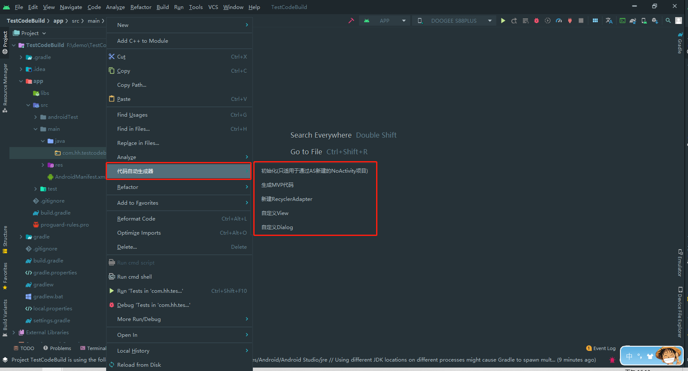

# android_base_library

#### 介绍

此项目是本人构建Android项目的基准库，提供插件自动初始化和生成一些常用代码。包含一些常用的依赖库，自用的基础组件等，方便之后快速构建Android项目，持续更新。

项目包含的常用组件有：

- MVP基础类：Activity、Fragment、View、Model、Presenter等基类
- 常用页面：登录、注册、找回密码等
- 常用工具：SP、定时器、状态栏、文件读写、时间、字符串校验、常用加密
- 常用组件：底部Table、顶部状态栏、带红点的TextView、功能列表（支持图片、文字、文字红点）、OptionView、Dialog(支持SweetAlert风格和IOS风格)、
  MyEditText(自定义文本输入框，支持左边图片右边文字)、底部选项框、Loading框
- 常用适配器，支持自定义空数据view、左滑更多操作等
- 网络请求：基于retrofit2封装、支持文件上传
- 日志模块：支持控制台打印、文件、UDP网络日志（需配置项目中的LogViewer日志工具使用）三种模式
- 硬件功能：二维码、条形码扫描识别
- 事件总线：RxBus
- so on

#### 使用插件自动构建项目
##### 1、导入插件到AndroidStudio [插件下载地址](https://gitee.com/allen056/mvp_generate_plugin/raw/master/MvpCodeAutoGeneratPlugin.jar "插件地址")

 将下载好的MvpCodeAutoGeneratPlugin.jar文件拖入AndroidStudio中完成插件安装，此时IDE会提示重启。重启后在项目目录下右键弹出菜单中会增加【项目自动构建工具的菜单】则说明插件安装成功，如下图。

##### 2、新建Android项目(注意：新建项目时选择No Activity模板)

##### 3、使用插件自动构建项目

##### 4、项目构建成功，运行看下效果

##### 5、自动生成MVP框架代码

#### 更新日志
##### V1.22.10
- 1、替换key-value存储方案为微信开源的MMKV，使用参照 com.hh.baselibrary.util.MMKVUtil

##### V1.22.9
- 1、树状目录增加一些常用功能
- 2、fix TitleView右侧文字某些情况下不显示的bug
- 3、修改部分组件默认的字体大小
- 4、ClickItemView增加可通过XML直接设置右侧显示文字

##### V1.22.5
- 1、fix 列表左滑操作后不关闭滑动视图的bug

##### V1.22.4
- 1、fix 树状目录整体刷新时未生效的bug

##### V1.22.3
- 1、BaseApplication中增加对所有Activity的管理
- 2、CheckItemView左侧图片大小调整为自适应
- 3、增加树状目录到基础库中
- 4、调整默认的小号字体为11sp
- 5、修改OptionUtil Title显示的字体大小和颜色，OptionUtild点击确定返回position和T
- 6、修改版本号命名方式（第一位为大版本、第二位为年份、第三位为递增版本）

##### V1.0.20

- 1、优化EditText的扩展方法showText显示double时如果为整数不显示.0

##### V1.0.19

- 1、ClickItemView支持右边文字颜色设置
- 2、修改默认字体大小为12sp(TODO 下个版本增加字体大小可配置)

##### V1.0.18

- 1、1.0.18 bugfix
- 2、初始化NormalRecyclerView时支持不传无数据显示View

##### V1.0.18

- 1、封装recylerView封装，支持显示无数据view自定义

##### V1.0.17

- 1、bug fix

##### V1.0.16

- 1、调整titleview右侧图片大小
- 2、支持设置沉浸式状态栏和透明状态栏选项

##### V1.0.15

- 1、TitleView支持右侧显示两个图标并设置点击事件;

##### V1.0.14

- 1、优化部分目录结构
- 2、增加部分已知类型的扩展方法

##### V1.0.9

- 1、TitleView支持自定义字体颜色、返回键图标、背景颜色等
- 2、增加Application基类，支持自定义app主题颜色（程序的Application需要继承此类，否则不能调用主题颜色修改）
- 3、增加一些通用页面：登录、注册、密码找回等
- 4、增加sample

##### V1.0.8

- 1、支持UDP日志打印，方便查看

##### V1.0.7

- 1、已知问题修复

##### V1.0.1

- 1、增加了支持右上角红点显示的RedTipTextView
- 2、增加通用的菜单列表ClickItemView

##### V1.0.0

- 第一次发布